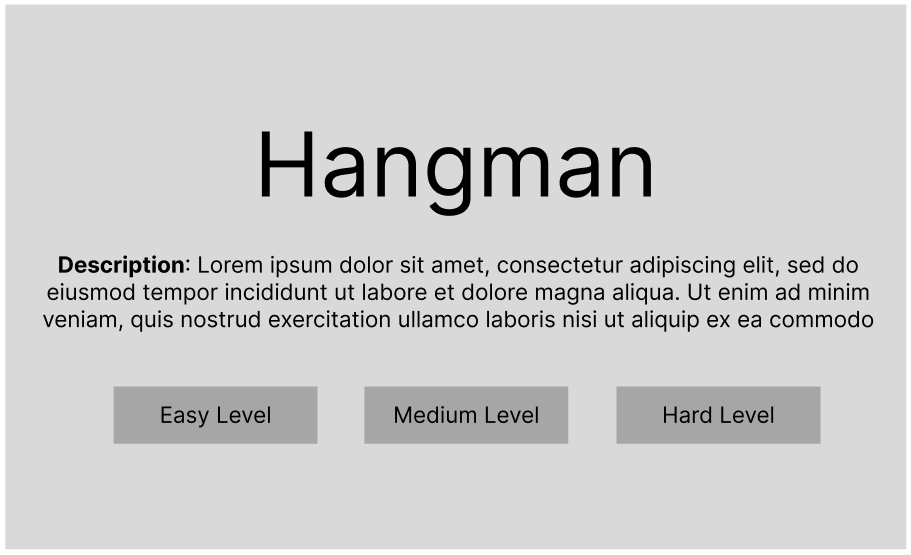
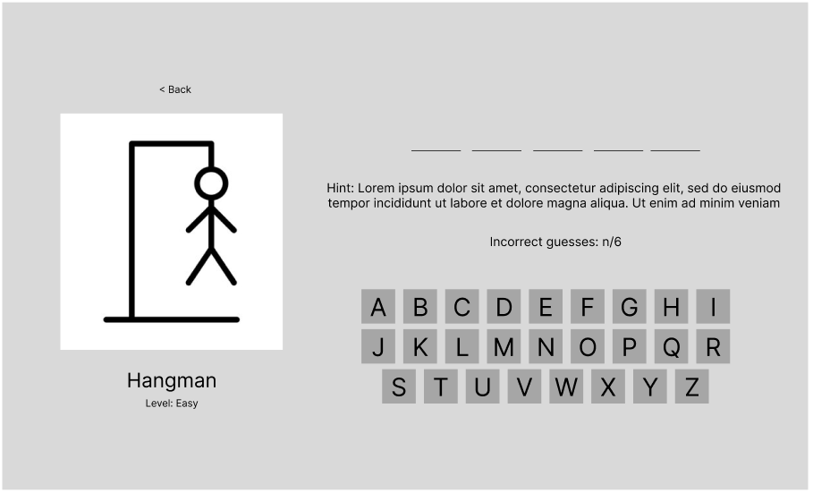
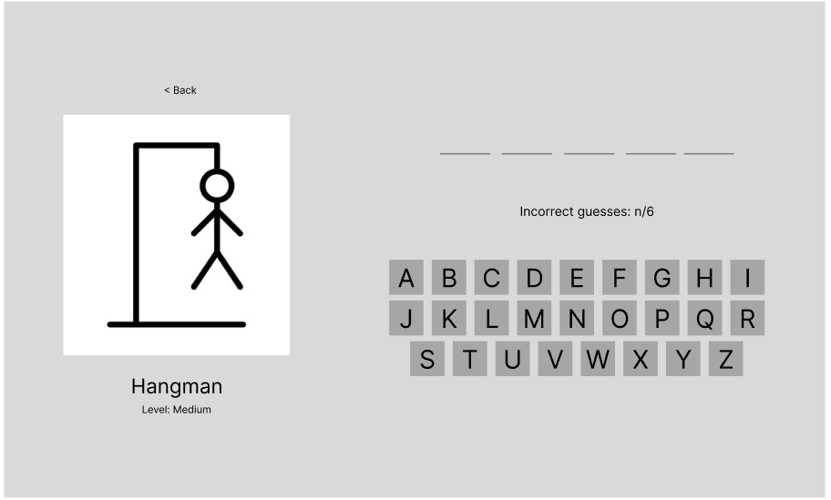
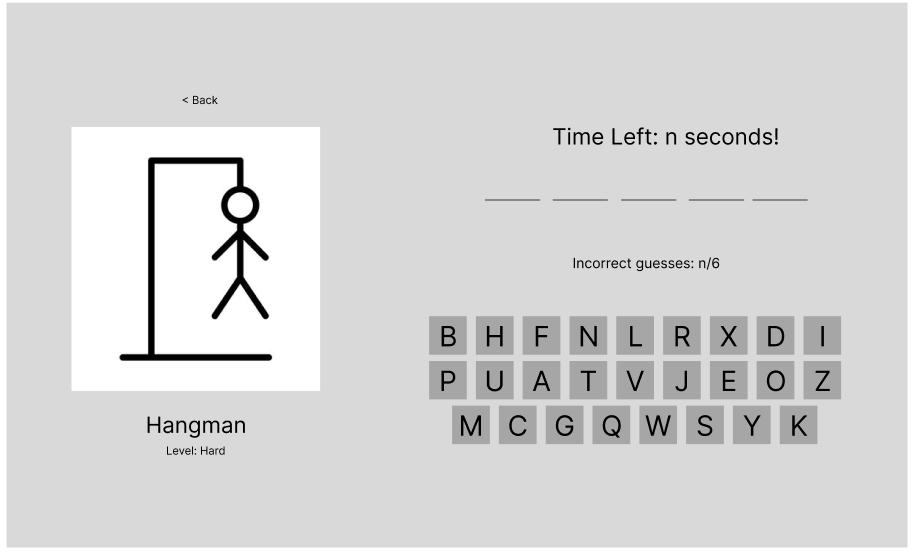
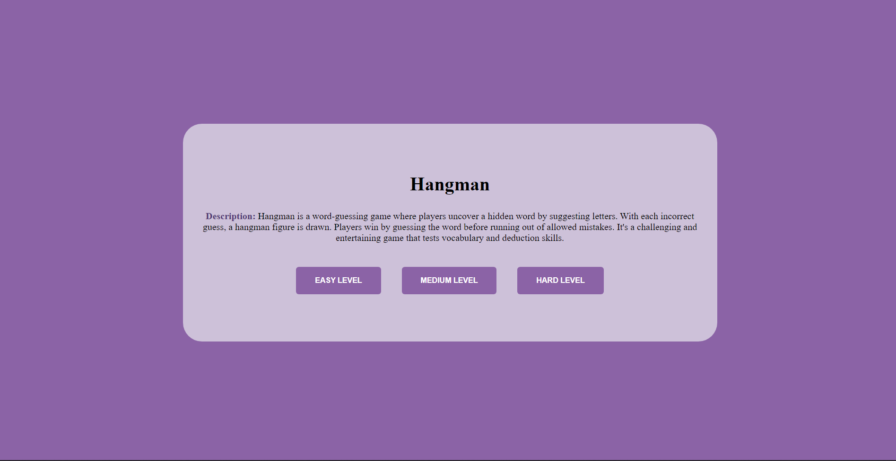
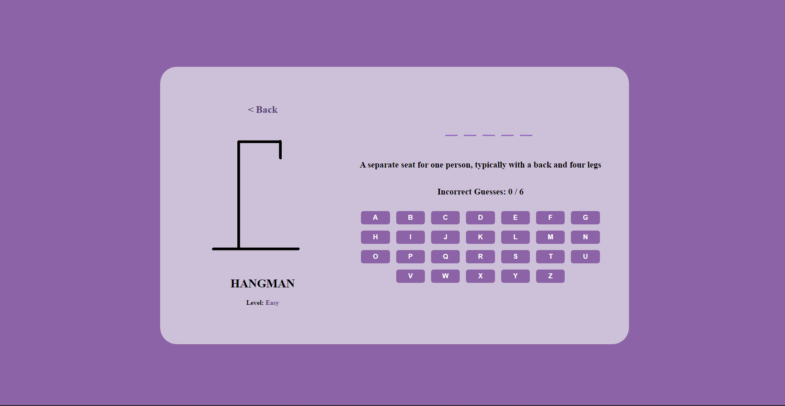
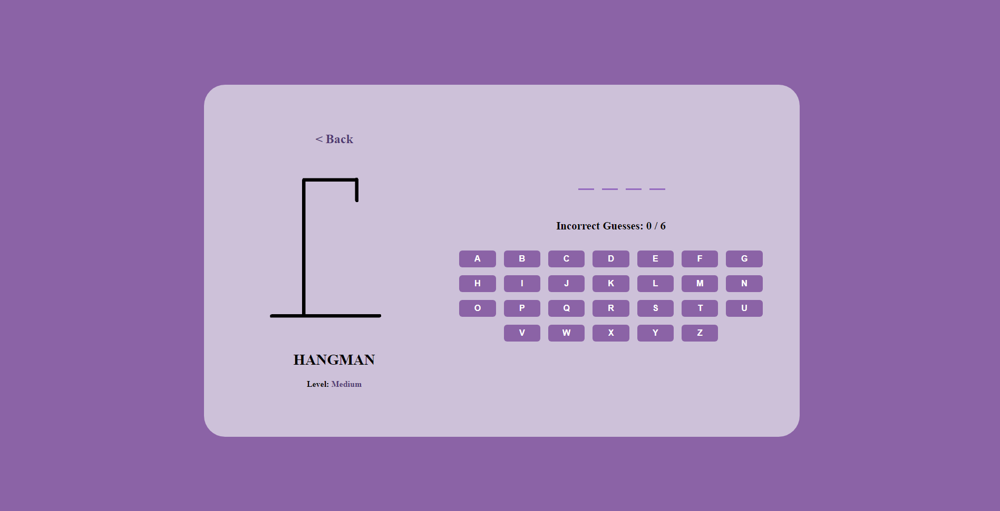
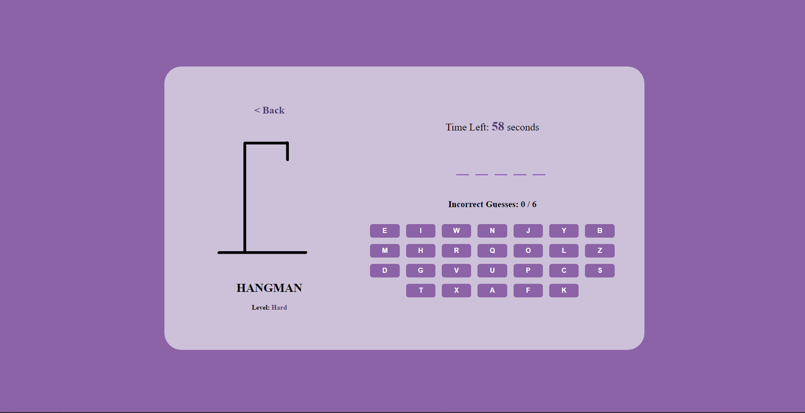
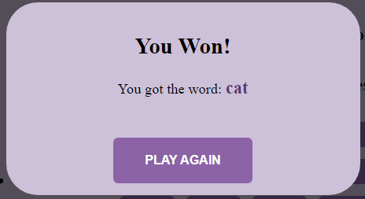
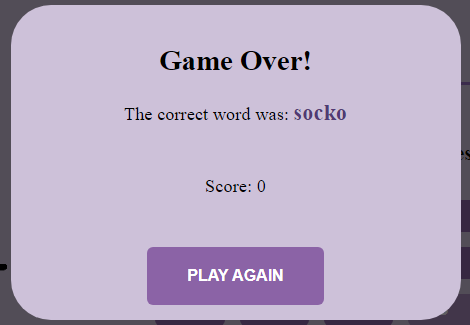

# Hangman Game
## Date: 24/1/2024
### By: Zainab Ahmed
#### [GitHub](https://github.com/zynbahmed) | [LinkedIn](https://www.linkedin.com/in/zainab-ahmed-795840278/)

***

### ***Description***
#### The Hangman Challenge is a traditional and straightforward word-guessing game accessible through web browsers. Offering a fundamental yet captivating experience, players can assess their vocabulary and problem-solving skills.
#### The game features three distinct difficulty levels, each presenting its challenges:
* Easy Level
  * Includes a hint to assist players in guessing the word.
* Medium Level
  * Follows the classic hangman game format.
* Hard Level
  * Shuffled keyboard for a more intricate guessing experience.
  * Timer set at 60 seconds, adding a time constraint.
  * Score System allowing players to continue playing as long as there is remaining time and guesses.
#### How to play the game: 
Upon landing on the home page, players can select their desired difficulty level. Once a level is chosen, players can make letter guesses using the displayed on-screen keyboard. Clicked letters become unclickable. In the hard level, players can continue playing as long as there is remaining time and guesses until either one or both expire. After the game concludes, whether in victory or defeat, players have the option to play again when the game over/you won window appears.
***

### ***Technologies Used***
* HTML
    * Generate the components of the game. 
* CSS
    * Design and format the components of the game.
* Javascript
    * Implementing the functionality of the game.
* Surge
    * Deploy the game 

***

### ***Getting Started***

##### A Trello board was used to keep track of development progress and can be viewed [here](https://trello.com/b/Fej04Qoz/hangman-game).
##### The project was deployed and can be viewed [here](https://high-pitched-mind.surge.sh/).

***

### ***Screenshots***
##### Wireframes
<div align="center">
  <pre>
    &nbsp;&nbsp;&nbsp;&nbsp;&nbsp;&nbsp;&nbsp;&nbsp;&nbsp;
  </pre>
</div>

##### Game Screenshots
<div align="center">
  <pre>
    &nbsp;&nbsp;&nbsp;&nbsp;&nbsp;&nbsp;&nbsp;&nbsp;&nbsp;&nbsp;&nbsp;&nbsp;&nbsp;&nbsp;&nbsp;
  </pre>
</div>

***
### ***What Have I learned***
Through the process of developing the Classic Hangman Challenge, I acquired a deeper understanding of web development, incorporating HTML for creating game elements, CSS for styling, and JavaScript for implementing game functionality. The game features three difficulty levels—Easy, Medium, and Hard—each presenting unique challenges. The Easy level provides a helpful hint, while the Hard level introduces a shuffled keyboard, a timer, and a scoring system. Implementing these features not only enhanced my technical skills but also underscored the importance of user experience and engagement in game design. Additionally, I gained insights into handling game logic, user input, and creating an interactive interface. Overall, this project offered valuable hands-on experience in building an interactive and enjoyable browser-based game.

```
const API_URL = 'https://random-word-api.herokuapp.com/all'

const getRandomWord = async () => {
    const response = await axios.get(API_URL)
    const words = response.data

    const randomIndex = Math.floor(Math.random() * words.length)
    const randomWord = words[randomIndex]

    currentWord = randomWord
    resetGame()
    startGameTimer(60)
}
```
The provided code is designed for the hard level, where it utilizes the built-in random math function to generate a random word. This process involves accessing an API containing an extensive collection of English words, adding an intriguing feature to the game that I take pride in.

***
### ***Future Updates***
- [ ] Word Categories
- [ ] Customizable Difficulty Settings
- [ ] Multi-word Phrases
- [ ] User Profiles and Statistics

***

### ***Credits***

##### setInterval Method : [W3schools](https://www.w3schools.com/jsref/met_win_setinterval.asp)

***
